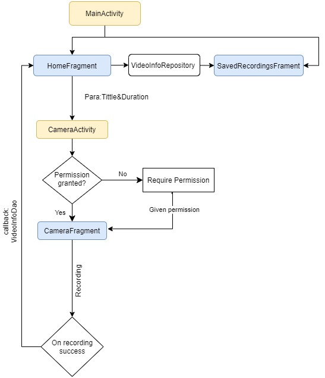

## Flowchart

### Implementation Summary

1. Navigation

Used ViewPager to implement the basic navigation.

2. RecyclerView & AsyncListDiffer

Take advantage of AsyncListDiffer to improve the UI refresh efficiency.
AsyncListDiffer will compare the new data set the old data set before UI
refreshment. It only updates the items who has difference in its data
model. For the RecyclerView, it displays the items in DESC order by
createdTime.

3. Data Persistence: Room

Room Entity: String title, int duration, long createdTime, String
absolutePath.

4. Camera Implementation & Permission Management

Separate the logic of permissions-request from video-recording by
putting permission management in CameraActivity and putting
video-recording logic solely in CameraFragment. For recording video, it
supports shoot different orientation of video. The UI will automatically
adjust according to the orientation of the screen.

5. UI Implementation

For HomeFragment, it uses ConstraintLayout, which will adapter to
different size of screen and different orientation of screen.

For CameraFragment, it will adapter its UI to both screen orientations.

For SavedRecordingsFragment, it has a neat animation when new data
inserted.
